# 🤖 LLM Training Pipeline: CPT → SFT → RAG

A comprehensive Large Language Model training pipeline that demonstrates the complete workflow from Continuous Pre-Training (CPT) through Supervised Fine-Tuning (SFT) to Retrieval-Augmented Generation (RAG).

## 🎯 Overview

This project implements a standard LLM training workflow that covers:

1. **CPT (Continuous Pre-Training)** - Domain-specific pre-training using Masked Language Modeling
2. **SFT (Supervised Fine-Tuning)** - Instruction following training with prompt-response pairs
3. **RAG (Retrieval-Augmented Generation)** - Knowledge-enhanced generation with retrieval capabilities

## 📁 Project Structure

```
llm-training/
├── data/
│   ├── pretrain.txt              # CPT input: unsupervised text
│   ├── sft.jsonl                 # SFT input: prompt + response pairs
│   └── rag.jsonl                 # RAG input: question + answer pairs
├── output/                       # Generated model outputs
│   ├── cpt/                      # CPT trained model
│   ├── sft/                      # SFT trained model
│   └── rag/                      # RAG trained model
├── train_cpt.py                  # CPT training script
├── train_sft.py                  # SFT training script
├── train_rag.py                  # RAG training script
├── main.py                       # Main pipeline executor
├── requirements.txt              # Python dependencies
└── README.md                     # This file
```

## 🚀 Quick Start

### Prerequisites

- Python 3.8+
- CUDA-capable GPU (recommended)
- 8GB+ RAM

### Installation

1. **Clone and navigate to the project:**
```bash
cd llm-training
```

2. **Install dependencies:**
```bash
pip install -r requirements.txt
```

3. **Run the complete pipeline:**
```bash
# Use Python main script
python main.py

# Or run individual phases
python train_cpt.py
python train_sft.py
python train_rag.py
```

## 📊 Training Phases

### Phase 1: CPT (Continuous Pre-Training)
- **Model**: BERT-base-uncased
- **Objective**: Masked Language Modeling (MLM)
- **Input**: Raw text data (`pretrain.txt`)
- **Output**: Domain-adapted language model

**Key Features:**
- 15% token masking probability
- Domain-specific vocabulary adaptation
- Contextual understanding improvement

### Phase 2: SFT (Supervised Fine-Tuning)
- **Model**: GPT-2
- **Objective**: Causal Language Modeling
- **Input**: Prompt-response pairs (`sft.jsonl`)
- **Output**: Instruction-following model

**Key Features:**
- Human-AI conversation format
- Response quality optimization
- Instruction following capabilities

### Phase 3: RAG (Retrieval-Augmented Generation)
- **Model**: RAG-sequence-nq
- **Objective**: Knowledge-enhanced generation
- **Input**: Question-answer pairs (`rag.jsonl`)
- **Output**: Retrieval-augmented model

**Key Features:**
- External knowledge integration
- Factual accuracy improvement
- Dynamic information retrieval

## 📋 Data Formats

### CPT Data (`pretrain.txt`)
```
Artificial Intelligence is transforming the world.
Machine learning is a subfield of AI.
Deep learning uses neural networks to process data.
...
```

### SFT Data (`sft.jsonl`)
```json
{"prompt": "What is AI?", "response": "Artificial Intelligence is a field..."}
{"prompt": "Who are you?", "response": "I'm an AI language model..."}
...
```

### RAG Data (`rag.jsonl`)
```json
{"question": "When was Google founded?", "answer": "Google was founded in 1998..."}
{"question": "What is the capital of France?", "answer": "The capital of France is Paris..."}
...
```

## ⚙️ Configuration

### Training Parameters

Each phase can be customized by modifying the `TrainingArguments` in respective scripts:

```python
training_args = TrainingArguments(
    output_dir="output/cpt",
    per_device_train_batch_size=8,
    num_train_epochs=3,
    learning_rate=5e-5,
    weight_decay=0.01,
    warmup_steps=100,
    fp16=True,  # Enable mixed precision
)
```

### Hardware Requirements

| Phase | Min GPU Memory | Recommended | Batch Size |
|-------|---------------|-------------|------------|
| CPT   | 4GB          | 8GB+        | 8          |
| SFT   | 6GB          | 12GB+       | 2          |
| RAG   | 8GB          | 16GB+       | 1          |

##  Model Outputs

After training, models are saved in the `output/` directory:

```
output/
├── cpt/
│   ├── config.json
│   ├── pytorch_model.bin
│   └── tokenizer.json
├── sft/
│   ├── config.json
│   ├── pytorch_model.bin
│   └── tokenizer.json
└── rag/
    ├── config.json
    ├── pytorch_model.bin
    └── tokenizer.json
```

## 🔍 Usage Examples

### Loading Trained Models

```python
from transformers import AutoTokenizer, AutoModel

# Load CPT model
cpt_tokenizer = AutoTokenizer.from_pretrained("output/cpt")
cpt_model = AutoModel.from_pretrained("output/cpt")

# Load SFT model
sft_tokenizer = AutoTokenizer.from_pretrained("output/sft")
sft_model = AutoModel.from_pretrained("output/sft")
```

### Inference Example

```python
# Example with SFT model
from transformers import pipeline

generator = pipeline("text-generation", 
                    model="output/sft", 
                    tokenizer="output/sft")

prompt = "Human: What is machine learning?\nAssistant:"
response = generator(prompt, max_length=100, num_return_sequences=1)
print(response[0]['generated_text'])
```

## 🛠️ Troubleshooting

### Common Issues

1. **CUDA Out of Memory**
   - Reduce batch size
   - Enable gradient checkpointing
   - Use mixed precision training (fp16)

2. **RAG Training Failures**
   - Normal for demo setup
   - Requires proper index configuration
   - Need larger datasets for production

3. **Import Errors**
   - Ensure all dependencies are installed
   - Check Python version compatibility
   - Verify CUDA setup for GPU training

### Performance Tips

- Use GPU for training (set `fp16=True`)
- Adjust batch size based on available memory
- Use gradient accumulation for larger effective batch sizes
- Monitor training with TensorBoard logs

## 🗺️ LLM三阶段训练流程图

```mermaid
flowchart LR
    %% 数据准备
    A1[pretrain.txt<br>无监督文本]:::data1
    A2[sft.jsonl<br>指令对话]:::data2
    A3[rag.jsonl<br>知识问答]:::data3

    %% 阶段
    B[CPT 预训练<br>BERT + MLM]:::stage
    C[output/cpt/<br>CPT模型]:::output
    D[SFT 微调<br>GPT-2 + 指令]:::stage
    E[output/sft/<br>SFT模型]:::output
    F[RAG 检索增强<br>RAG-sequence-nq]:::stage
    G[output/rag/<br>RAG模型]:::output

    %% 连接
    A1 --> B --> C --> D --> E --> F --> G
    A2 --> D
    A3 --> F

    %% 样式
    classDef data1 fill:#ffb3ba,stroke:#fff,stroke-width:2px,color:#222,font-weight:bold;
    classDef data2 fill:#bae1ff,stroke:#fff,stroke-width:2px,color:#222,font-weight:bold;
    classDef data3 fill:#baffc9,stroke:#fff,stroke-width:2px,color:#222,font-weight:bold;
    classDef stage fill:#222,stroke:#fff,stroke-width:2px,color:#ffe066,font-size:16px,font-weight:bold;
    classDef output fill:#444,stroke:#ffe066,stroke-width:2px,color:#ffe066,font-weight:bold;
    class A1 data1;
    class A2 data2;
    class A3 data3;
    class B,D,F stage;
    class C,E,G output;
```



## 📚 References

- [Hugging Face Transformers](https://huggingface.co/transformers/)
- [Hugging Face Datasets](https://huggingface.co/datasets/)
- [PyTorch Documentation](https://pytorch.org/docs/)
- [RAG Paper](https://arxiv.org/abs/2005.11401)

## 🤝 Contributing

Feel free to submit issues, feature requests, or pull requests to improve this training pipeline.

## 📄 License

This project is open source and available under the MIT License.

---

**Note**: This is a demonstration pipeline using the exact code structure from the original specification. The training scripts use minimal configurations suitable for demo purposes.
