# Advertising Intelligent Agent MCP Project

An LLM-driven agent system for advertising campaign management that supports MCP (Model Context Protocol) communication modes.

## Features

- **LLM Integration**: Uses Qwen3-30B-A3B (free open-source) from ModelScope for intelligent campaign planning
- **MCP Protocol**: Supports stdio, SSE, and streamable HTTP communication modes using FastMCP
- **Advertising Tools**: Budget calculator, effect analyzer, compliance checker, and VAR image generator
- **Multi-platform Support**: TikTok, Facebook, Instagram, Google Ads
- **Regional Compliance**: Checks advertising regulations across regions

## Project Structure

```
mcp-agent/
├── main.py                 # Project entry point
├── agent/
│   └── agent.py           # LLM agent logic and tool calling
├── mcp_impl/              # MCP server implementation using FastMCP
│   ├── server.py          # Simplified FastMCP server with all modes
│   └── client.py          # MCP client implementations
├── tools/
│   └── ad_tools.py        # Advertising tool implementations
├── config/
│   └── config.yaml        # Configuration file
├── requirements.txt        # Python dependencies
└── README.md              # This file
```

## Architecture Overview

```mermaid
graph TB
    %% User Interaction
    User["👤 User"] --> Agent["🤖 Agent Core\nQwen3-30B-A3B"]

    %% Agent Processing Flow
    Agent --> LLM1["🧠 LLM1: Query Analysis & Tool Planning"]
    LLM1 --> |Tool Calls| MCP_Client["MCP Client"]

    %% Server start and mode selection (exclusive)
    Start["Start Server\npython main.py server --mode <mode>"]
    MCP_Client --> Start
    Start --> Choice{"Select one mode"}
    Choice --> STDIO["📡 Stdio Mode\nLocal Process\n(no network)"]
    Choice --> SSE["🌐 SSE Mode\nHTTP Server-Sent Events\n(/sse, /execute)"]
    Choice --> HTTP["📡 Streamable HTTP\nHTTP Streaming\n(/stream)"]

    %% MCP Server
    subgraph "🛠️ MCP Server (FastMCP)"
        STDIO --> Server["Server Core (active mode only)"]
        SSE --> Server
        HTTP --> Server
        Server --> Tool_Manager["Tool Manager"]
    end

    %% Advertising Tools
    subgraph "🔧 Advertising Tools"
        Tool_Manager --> Budget["💰 Budget Calculator"]
        Tool_Manager --> Effect["📊 Effect Analyzer"]
    Tool_Manager --> Compliance["⚖️ Compliance Checker"]
    Tool_Manager --> VAR["🖼️ VAR Image Generator"]
    end

    %% Results Flow Back
    Budget --> |Results| Tool_Manager
    Effect --> |Results| Tool_Manager
    Compliance --> |Results| Tool_Manager

    Tool_Manager --> |Tool Results| Server
    Server --> |Results| MCP_Client

    %% Context assembly
    MCP_Client --> Context["📦 Context Assembler\n(pack tool results)"]

    %% Error handling
    Server -.-> Error["❗ Error Handling\n(timeout/retry/fallback)"]
    Error -.-> Context

    %% Final Response
    Context --> LLM2["🧠 LLM2: Final Response Generation"]
    LLM2 --> |Final Answer| Agent
    Agent --> |Response| User

    %% Optional optimization
    subgraph "⚡ Optional Orchestration Trick"
        Orchestrator["🔄 Orchestrator\n(streaming, mid-output interception)"]
        Agent --> Orchestrator
        Orchestrator --> LLM["🧠 Single LLM Call\n(plan → tool → integrate → answer)"]
        LLM --> Agent
    end

    %% Styling
    classDef userClass fill:#e1f5fe
    classDef agentClass fill:#f3e5f5
    classDef llmClass fill:#fce4ec
    classDef serverClass fill:#e8f5e8
    classDef toolClass fill:#fff3e0
    classDef commClass fill:#fce4ec
    classDef errorClass fill:#ffebee
    classDef optClass fill:#ede7f6

    class User userClass
    class Agent agentClass
    class LLM1,LLM2,llmClass llmClass
    class Server,Tool_Manager serverClass
    class Budget,Effect,Compliance toolClass
    class STDIO,SSE,HTTP,Start commClass
    class Error errorClass
    class Orchestrator,LLM optClass
```



## Installation

1. **Clone and navigate to the project:**

```bash
cd mcp-agent
```

2. **Install dependencies:**

```bash
python -m venv .venv
source .venv/bin/activate  # On Windows use `.venv\Scripts\activate`
pip install -r requirements.txt
```

3. **Set up environment (optional):**

Create a `.env` file in the project root if you need custom configurations:

```bash
# Optional: Add custom model path or other settings
# ~/.cache/modelscope/hub/Qwen/Qwen3-30B-A3B
MODELSCOPE_CACHE_DIR=/path/to/cache
```

**Note**: The Qwen3-30B-A3B model (~60GB) will be automatically downloaded from ModelScope on first use. Ensure you have sufficient disk space and a stable internet connection.

## Configuration

Edit `config/config.yaml` to configure:

- **Communication Mode**: `stdio`, `sse`, or `streamhttp`
- **LLM Settings**: Model (Qwen3-30B-A3B), temperature, max tokens, device (auto/cpu/cuda/mps)
- **Server Settings**: Host, port, endpoints
- **Tool Settings**: Enabled tools and parameters

## Usage

### Starting the MCP Server

#### Stdio Mode (default)
```bash
python main.py server --mode stdio
```

#### SSE Mode

```bash
python main.py server --mode sse
```

Server runs on [http://127.0.0.1:8000/sse](http://127.0.0.1:8000/sse)

#### Streamable HTTP Mode

```bash
python main.py server --mode streamhttp
```

Server runs on [http://127.0.0.1:8000/stream](http://127.0.0.1:8000/stream)

### Running the Agent

In a separate terminal, start the agent:
```bash
python main.py agent
```

The agent will start an interactive session where you can ask questions like:
- "10万美元投东南亚TikTok广告，应该怎么分配预算？"
- "分析Facebook广告效果，预算5000美元，目标受众是年轻人"
- "检查这个广告文案在欧洲的合规性"

### Demo Mode

Run a quick demo:
```bash
python main.py demo
```

## Testing Examples

### Budget Calculation Test

1. Start server in stdio mode:

```bash
python main.py server --mode stdio
```

2. In another terminal, run agent:

```bash
python main.py agent
```

3. Ask: "100000美元预算，投放东南亚TikTok和Facebook，持续30天，怎么分配？"

Expected output: Budget allocation recommendations with platform breakdowns.

### Effect Analysis Test

Ask: "分析TikTok广告效果，预算20000美元，目标受众是18-25岁年轻人，活动类型是品牌认知"

Expected output: Performance metrics predictions (impressions, clicks, conversions, ROI).

### Compliance Check Test

Ask: "检查这个广告'免费送货到家'在欧洲Facebook平台的合规性，目标受众是所有年龄段"

Expected output: Compliance status and recommendations.

## Communication Modes

The MCP server supports three communication modes, but only one mode can be started at a time — you must choose one when launching the server (for example `--mode stdio`). The server will bind the endpoints for the selected mode only.

### Stdio Mode

- **Use Case**: Local development, testing
- **Pros**: Simple, no network setup
- **Cons**: Single client connection

### SSE Mode (details)

- **Use Case**: Real-time updates, web applications
- **Pros**: Server-sent events, bidirectional
- **Endpoint**: `/sse` for events, `/execute` for tool calls

### Streamable HTTP Mode (details)

- **Use Case**: High-throughput, streaming responses
- **Pros**: HTTP-based, scalable
- **Endpoint**: `/stream` for streaming tool execution

## Switching Communication Modes

1. Edit `config/config.yaml`:

```yaml
mode: sse  # or streamhttp
```

1. Restart both server and agent with the new configuration.

## Troubleshooting

### Common Issues

1. **Import Errors**: Ensure all dependencies are installed
2. **Model Download**: Qwen3-30B-A3B is a large model (~60GB), ensure sufficient disk space and bandwidth
3. **GPU Memory**: For GPU inference, ensure adequate VRAM (at least 32GB recommended)
4. **CPU-only Usage**: Set `device: cpu` in config.yaml if you don't have GPU (slower but works)
5. **Server Connection**: Verify host/port in config.yaml
6. **Tool Execution**: Check tool parameters match expected format

### Debug Mode

Add debug logging:

```python
import logging
logging.basicConfig(level=logging.DEBUG)
```

## Development

### Adding New Tools

1. Create tool class inheriting from MCP Tool base class
2. Define input/output Pydantic models
3. Add to `AD_TOOLS` list in `tools/ad_tools.py`
4. Update agent prompt in `agent/agent.py`

### Extending Communication Modes

1. Implement new server/client classes in `mcp_impl/`
2. Add to factory methods
3. Update configuration options

## License

This project is open source and available under the MIT License.
