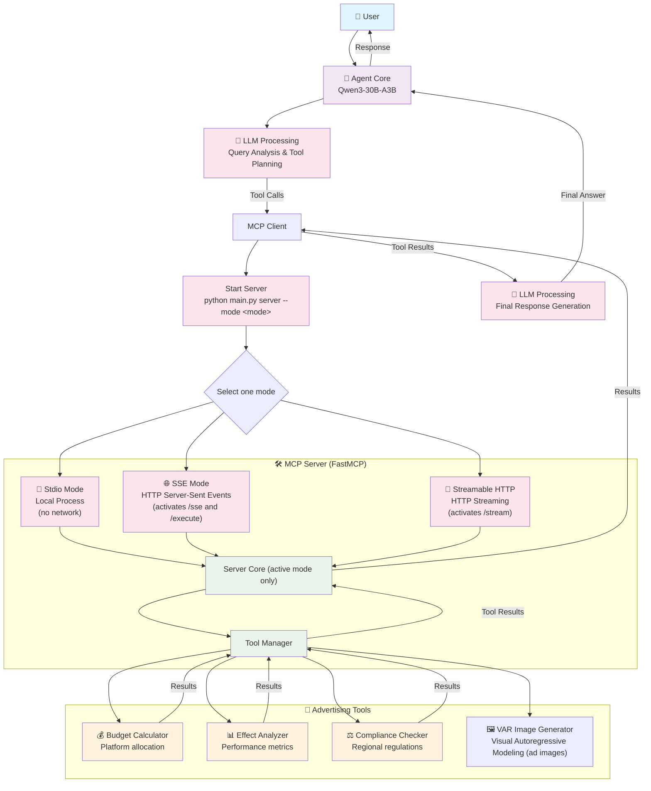

```mermaid
graph TB
    %% User Interaction
    User["👤 User"] --> Agent["🤖 Agent Core\nQwen3-30B-A3B"]

    %% Agent Processing Flow
    Agent --> LLM1["🧠 LLM Processing\nQuery Analysis & Tool Planning"]
    LLM1 --> |Tool Calls| MCP_Client["MCP Client"]

    %% Server start and mode selection (exclusive)
    Start["Start Server\npython main.py server --mode &lt;mode&gt;"]
    MCP_Client --> Start
    Start --> Choice{"Select one mode"}
    Choice --> STDIO["📡 Stdio Mode\nLocal Process\n(no network)"]
    Choice --> SSE["🌐 SSE Mode\nHTTP Server-Sent Events\n(activates /sse and /execute)"]
    Choice --> HTTP["📡 Streamable HTTP\nHTTP Streaming\n(activates /stream)"]

    %% MCP Server (single active mode binds endpoints)
    subgraph "🛠️ MCP Server (FastMCP)"
        STDIO --> Server["Server Core (active mode only)"]
        SSE --> Server
        HTTP --> Server
        Server --> Tool_Manager["Tool Manager"]
    end

    %% Advertising Tools
    subgraph "🔧 Advertising Tools"
        Tool_Manager --> Budget["💰 Budget Calculator\nPlatform allocation"]
        Tool_Manager --> Effect["📊 Effect Analyzer\nPerformance metrics"]
    Tool_Manager --> Compliance["⚖️ Compliance Checker\nRegional regulations"]
    Tool_Manager --> VAR["🖼️ VAR Image Generator\nVisual Autoregressive Modeling (ad images)"]
    end

    %% Results Flow Back
    Budget --> |Results| Tool_Manager
    Effect --> |Results| Tool_Manager
    Compliance --> |Results| Tool_Manager

    Tool_Manager --> |Tool Results| Server
    Server --> |Results| MCP_Client
    MCP_Client --> |Tool Results| LLM2["🧠 LLM Processing\nFinal Response Generation"]
    LLM2 --> |Final Answer| Agent
    Agent --> |Response| User

    %% Styling
    classDef userClass fill:#e1f5fe
    classDef agentClass fill:#f3e5f5
    classDef llmClass fill:#fce4ec
    classDef serverClass fill:#e8f5e8
    classDef toolClass fill:#fff3e0
    classDef commClass fill:#fce4ec

    class User userClass
    class Agent agentClass
    class LLM1,LLM2 llmClass
    class Server,Tool_Manager serverClass
    class Budget,Effect,Compliance toolClass
    class STDIO,SSE,HTTP,Start commClass
```
